<p align="center">
   
</p>

<p align="center">
   A local-first AI journal that learns your habits, finds recurring patterns, and helps you reflect on what you could improve.
</p>

Everything happens on your own machine. Your writing never leaves your computer, and the AI that reads it runs locally through Ollama, so there is no account to create, no key to paste, and no company holding a copy of your thoughts.

## Table of Contents

- [Screenshots](#screenshots)
- [What DayBook Does](#what-daybook-does)
- [Requirements](#requirements)
- [AI Model](#ai-model)
- [Installation](#installation)
- [Running DayBook](#running-daybook)
- [How the Project Works](#how-the-project-works)
- [Project Structure](#project-structure)
- [Database](#database)
- [How AI Answers Questions](#how-ai-answers-questions)
- [Journal Images](#journal-images)
- [Session and Ownership](#session-and-ownership)
- [State That Lives Only in Memory](#state-that-lives-only-in-memory)
- [Frontend Details](#frontend-details)
- [Backend Details](#backend-details)
- [API Reference](#api-reference)
- [Data on Disk](#data-on-disk)
- [Development](#development)
- [Privacy](#privacy)
- [Troubleshooting](#troubleshooting)
- [License](#license)

## Screenshots

| Home | Journal Spread |
| :---: | :---: |
| 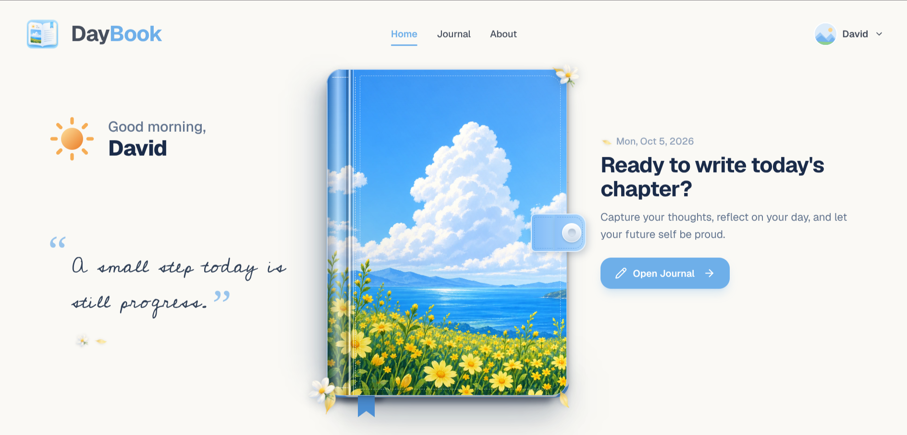 | 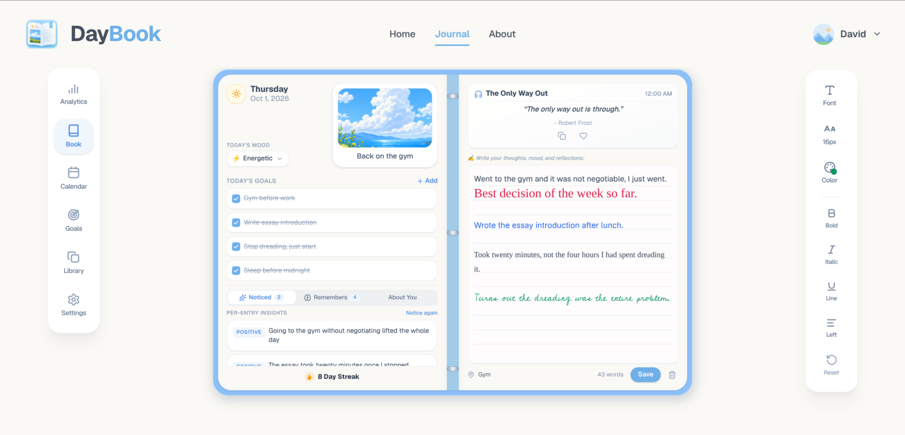 |

| Analytics | Goals |
| :---: | :---: |
| 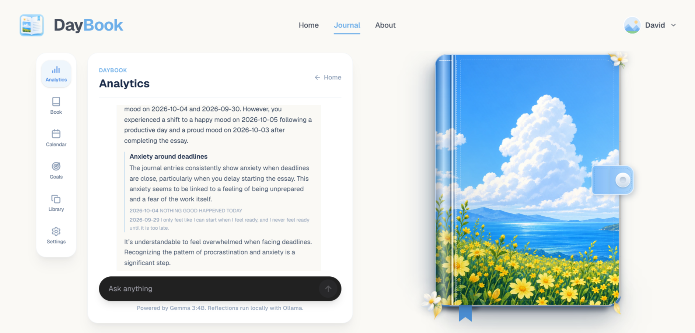 | 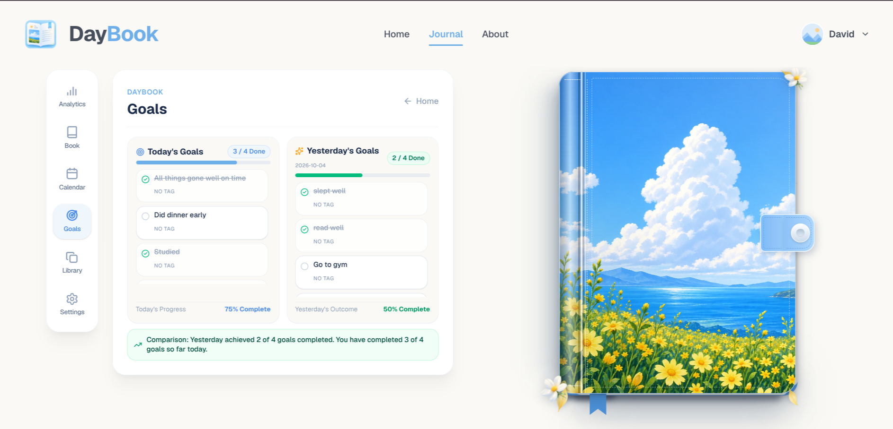 |

| Calendar | Library |
| :---: | :---: |
| 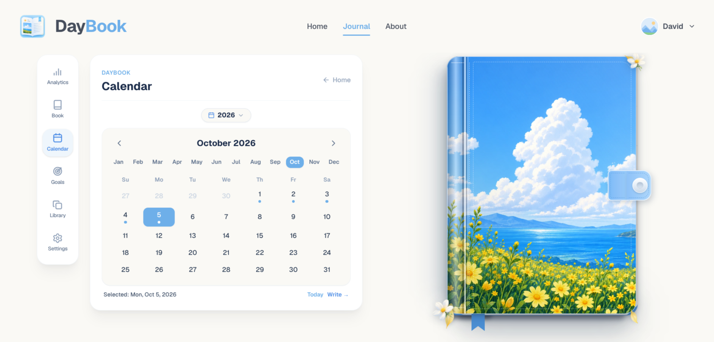 | 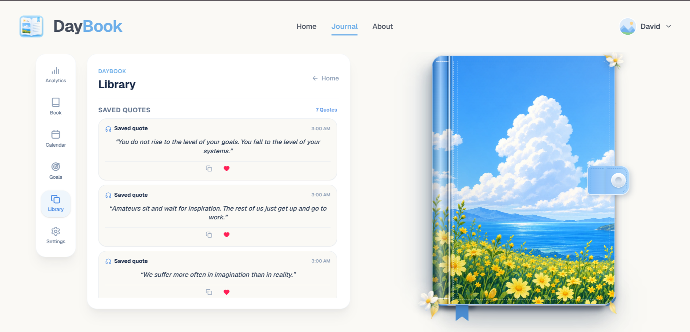 |

## What DayBook Does

DayBook is built around a few simple habits that turn into something useful over time.

**Write a page a day.** Each date has one journal entry with a topic, a mood, weather, a location, and free-form writing in a rich text editor.

**Set goals next to your writing.** Goals belong to a specific date, so you can look back and see what you actually meant to do, next to what you ended up writing about.

**Get a real reflection, not a guess.** Ask DayBook a question in plain language. It reads your recent entries, goals, and profile, then answers using only what is actually in your journal.

**Let DayBook remember things.** The AI can suggest a memory worth keeping, such as the fact that you sleep badly before exam weeks. You approve or dismiss every suggestion, so nothing is remembered without your say so.

**Watch your streak.** A streak counts consecutive days with an entry, ending today. It resets honestly instead of being generous with the dates.

**Keep one image per entry.** Each journal page can hold a single photo. You can upload one or paste one from your clipboard. It is stored as a real file on your disk, and it comes back when you reopen that date.

**Read back your quotes.** Every entry gets a quote. Save the ones that land and find them later in your Library.

## Requirements

You need these four things installed:

- Node.js 26 or newer
- PNPM
- Ollama
- Git

Check them all at once:

```bash
node --version
pnpm --version
ollama --version
git --version
```

## AI Model

DayBook defaults to Gemma 3 4B through Ollama, but you can select and install other models from the Settings tab. It runs entirely on your own hardware, which is why no API key exists anywhere in this project.

Pull the model once:

```bash
ollama pull gemma3:4b
```

Start Ollama:

```bash
ollama serve
```

You can talk to the model directly to confirm it works:

```bash
ollama run gemma3:4b
```

The active model is fetched dynamically. While Gemma is the default first option, the Settings tab lets you change and install different models.

## Installation

Clone the repository:

```bash
git clone https://github.com/greenbugx/Daybook
cd DayBook
```

Install frontend dependencies:

```bash
pnpm install
```

Install backend dependencies:

```bash
cd server
pnpm install
cd ..
```

## Running DayBook

DayBook runs as three separate local processes. None of them talk to the internet.

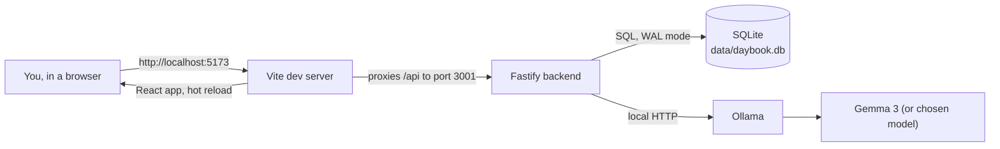

1. React frontend on port 5173
2. Fastify backend on port 3001
3. Ollama, usually on port 11434

### 1. Start Ollama

In a terminal:

```bash
ollama serve
```

Make sure the model is available:

```bash
ollama pull gemma3:4b
```

### 2. Start the backend

In another terminal:

```bash
cd server
pnpm dev
```

The backend runs at:

```text
http://localhost:3001
```

It listens on `127.0.0.1` only, so other devices on your network cannot reach it.

### 3. Start the frontend

In another terminal from the project root:

```bash
pnpm dev
```

The frontend normally runs at:

```text
http://localhost:5173
```

Open that URL in your browser.

On first run DayBook asks for a display name. After that, the onboarding flow collects a bit about you, which is what makes later reflections feel personal.

## How the Project Works

The app is split into two halves. The frontend is a React single-page app. The backend is a Fastify server that owns the database, the files on disk, and every call to the model. The frontend never talks to Ollama directly.

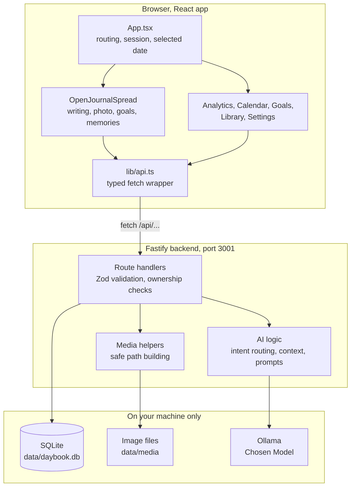

### How a page loads

Opening a date does a few things at the same time, and each one guards itself against a late reply landing on the wrong date.

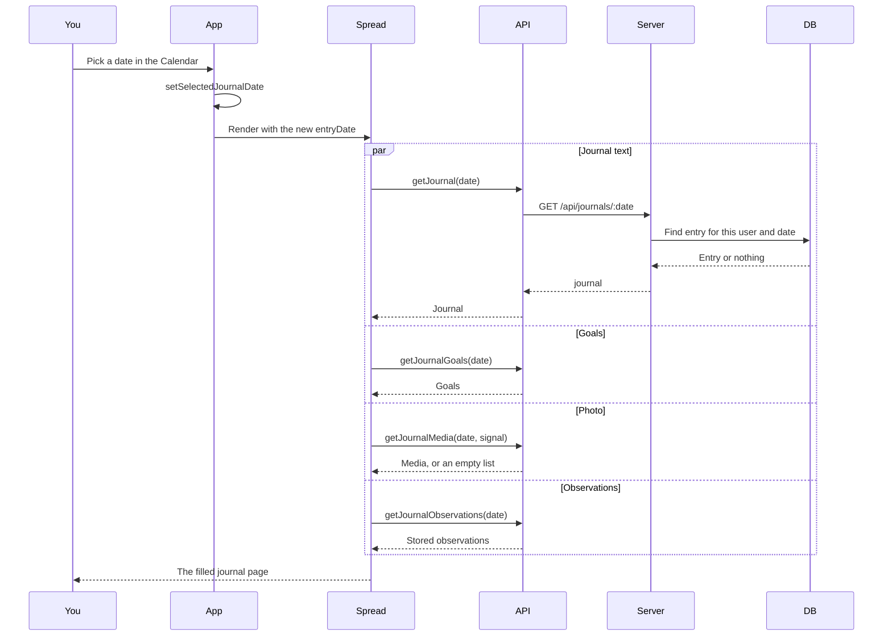

Every one of those requests carries an `AbortController`. When you switch dates before a reply arrives, the old request is cancelled and its result is thrown away, so October 4 content can never appear on October 5.

### Saving an entry

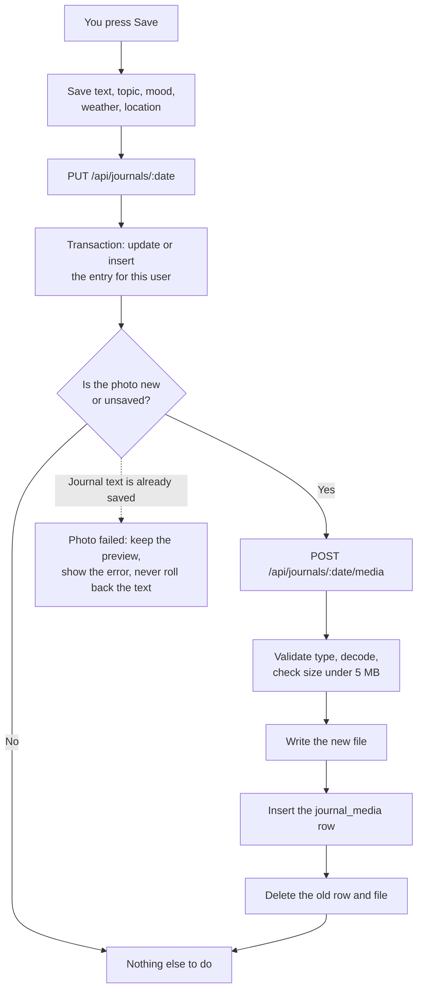

The photo is written after the text, and the text is never undone because of a photo problem. If the image upload fails you keep your writing and your preview, and a small message tells you what happened.

## Project Structure

```text
DayBook
├── data/                       Created at runtime, git ignored
│   ├── daybook.db              SQLite database
│   └── media/                  Uploaded journal images
│       └── <userId>/
│           └── <entryDate>/
│               └── <mediaId>.png
├── server/
│   ├── drizzle.config.ts       Drizzle Kit points at data/daybook.db
│   └── src/
│       ├── index.ts            All routes, AI logic, streak, media
│       └── db/
│           ├── client.ts       Opens SQLite, turns on WAL and foreign keys
│           └── schema.ts       Table definitions and relations
├── src/
│   ├── App.tsx                 Page routing, session, shared state
│   ├── main.tsx                React entry point
│   ├── index.css               Tailwind and font setup
│   ├── lib/
│   │   └── api.ts              Typed client for every backend route
│   ├── components/
│   │   ├── InteractiveBook.tsx     The closed and opening book
│   │   ├── JournalBook.tsx         The book wrapper
│   │   ├── OpenJournalSpread.tsx   The writing page
│   │   ├── AnalyticsAIView.tsx     The AI chat panel
│   │   ├── CalendarView.tsx        Month view and date picking
│   │   ├── GoalsView.tsx           Today and yesterday goals
│   │   ├── LibraryView.tsx         Saved quotes
│   │   ├── SettingsView.tsx        Model choice
│   │   ├── JournalToolbar.tsx      Text formatting
│   │   ├── FirstRunRegistration.tsx    Name entry
│   │   ├── OnboardingView.tsx      Profile questions
│   │   ├── journalTextStyle.ts     Editor style defaults
│   │   └── ui/                    Small shared pieces
│   └── assets/
│       ├── images/              Logo, cover art, scene
│       └── fonts/               Cedarville Cursive
├── vite.config.ts              Dev server and the /api proxy
└── README.md
```

## Database

SQLite holds everything, managed through Drizzle ORM. The schema lives in `server/src/db/schema.ts`.

| Table | What it holds | Important links |
| :--- | :--- | :--- |
| `users` | Display name and activity timestamps | root of everything |
| `user_profiles` | Onboarding answers, reflection style, things to avoid assuming | one per user |
| `app_settings` | AI model name, theme | one per user |
| `local_sessions` | The active local session | points at a user |
| `journal_entries` | One entry per user per date | unique on user and date |
| `journal_media` | The image reference for an entry | cascades on entry delete |
| `journal_goals` | Goals belonging to a date | cascades on entry delete |
| `quotes` | The quote pool | standalone |
| `saved_quotes` | Quotes you kept | points at a quote |
| `memories` | Approved facts about you | optional source entry |
| `journal_observations` | AI observations for an entry | cascades on entry delete |
| `experiments` | Feature flags and experiments | standalone |

Two database settings matter. `journal_mode` is `WAL`, so reads stay fast while a write is happening. `foreign_keys` is `ON`, so deleting a journal entry removes its goals, media rows, and observations in one step without any extra code.

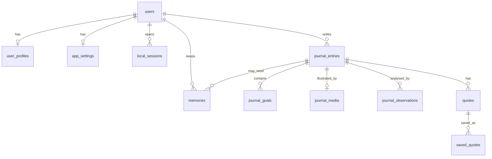

## How AI Answers Questions

The interesting part of the backend is how it decides what to do with a question. It avoids spending model time on questions that simple SQL can answer on its own.

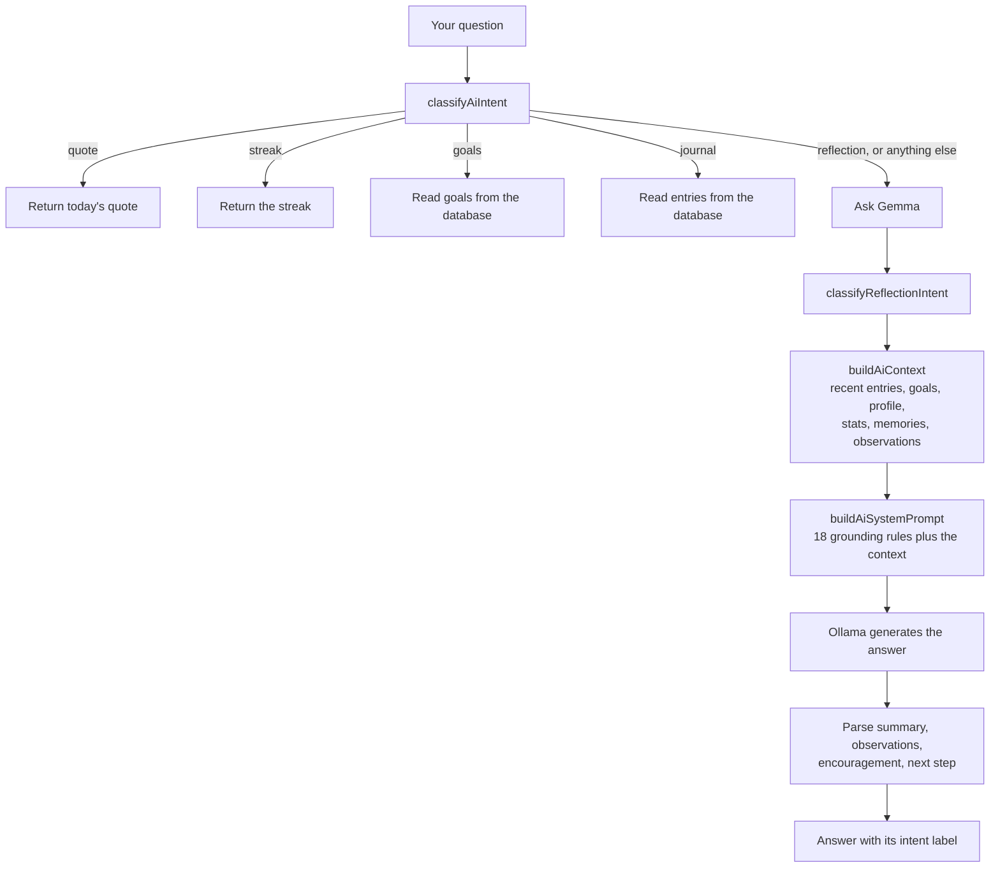

Questions that a database query can settle never reach the model. Ask how many entries you have written and that comes straight from `journal_entries`. This keeps answers exact and makes them fast.

Questions that need interpretation do reach the model, and they are grounded hard. The prompt tells the model that its only source of truth is the context handed to it, that it must never invent entries, dates, goals, or statistics, that it must separate a one-time observation from a recurring pattern, and that it must say plainly when there is not enough evidence. It is also told to avoid diagnosing anything about mental or physical health, and to respect the `thingsToAvoidAssuming` list from the profile.

Eight reflection intents shape how the model reads the context:

| Intent | Looks for |
| :--- | :--- |
| `RECURRING_PATTERNS` | The same thing showing up again |
| `MOOD_EMOTIONAL` | Mood and emotional tone |
| `STRUGGLES` | What keeps getting in the way |
| `WINS_PROGRESS` | Wins, progress, momentum |
| `GOALS` | Goal follow through |
| `HABITS_ROUTINES` | Routines and timing |
| `CHANGE_OVER_TIME` | How things shifted over time |
| `SELF_UNDERSTANDING` | What DayBook knows about you |
| `GENERAL_REFLECTION` | Anything else reflective |

The same grounding style is used for per-entry observations and for memory suggestions. Memory suggestions are never saved straight away. They wait for you to confirm them.

### The streak is deterministic

The streak is pure arithmetic on your entry dates, with no model involved. It converts each date into a day number, ignores anything in the future, and returns zero unless you wrote something today. From there it counts backwards while days are unbroken. If you skip a day the streak ends there rather than quietly jumping over the gap.

## Journal Images

Each journal date holds at most one image. There is no gallery, no cloud storage, and no AI analysis of pictures.

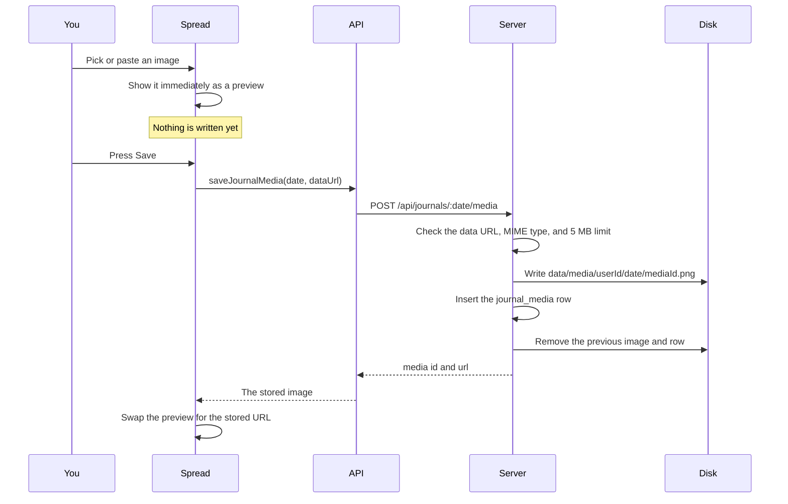

A few rules keep this simple and safe. JPEG, PNG, and WebP are the accepted formats. Anything over 5 MB is rejected with a clear message rather than being quietly shrunk. The file name is a server generated UUID, so your original file name never touches the filesystem. The server builds every path from your user id and the date you asked for, and refuses any path that resolves outside the media folder, so there is no way to read or write arbitrary files. Deleting an entry removes its image row through the database, and the backend also deletes the physical file so nothing is left orphaned.

If you select an image and then close without saving, the preview is discarded and nothing was written. That is intentional. Saving is the only thing that persists.

## Session and Ownership

There is no password and no login form. DayBook treats this as a single-user app running on your own laptop.

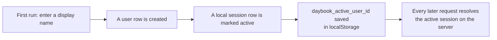

The only browser storage is the active user id and your editor formatting preferences.

Ownership is decided on the server for every single request, using the same path each time: find the active session, find that user's journal entry for the requested date, then work only with the media or goals hanging off that entry. The client is never trusted to send a user id, an entry id, or a file path.

## State That Lives Only in Memory

Two things deliberately do not touch the disk.

The AI chat conversation lives in React state inside `App.tsx`. That is enough to keep your conversation while you move between Analytics, Goals, Calendar, and Library, because switching tabs does not unmount `App`. Reload the page and it starts fresh, which is the intended behaviour. Nothing about the chat is written to localStorage, sessionStorage, IndexedDB, or the database.

Your editor formatting preferences are the one deliberate exception, and they are tiny. The font, size, colour, and bold, italic, and underline choices are saved under `daybook_journal_text_style` so your spread looks the same tomorrow.

## Frontend Details

`App.tsx` is the only place that decides which view you see. It holds the current page, the active sidebar tab, the selected journal date, the journal itself, and the chat messages, then passes what each view needs as props.

A few details worth knowing if you plan to read the code.

The journal spread is the heaviest component. It owns the editor, the photo, the goals list, the quote, the observations, and the memory panel. Each of those loads on its own and each guards against stale replies with an `AbortController`.

The photo state is small on purpose. It tracks the current URL, whether that image is saved or newly picked, and which media id it came from. That is enough to avoid re-uploading the same image every time you press Save.

Switching from the Book tab to another sidebar tab runs a short closing animation first, which is why the sidebar button highlights a moment before the panel appears.

The Goals tab deliberately ignores the date you pick in the Calendar. It always shows today and the previous entry that had goals, so browsing old dates does not make your progress bars jump around.

## Backend Details

`server/src/index.ts` is a single file that holds every route, the AI logic, the streak calculation, and the media helpers. It is long, but it is linear and easy to follow, and it keeps the whole request path visible in one place.

Requests are validated with Zod before anything touches the database. Dates must match the `YYYY-MM-DD` shape, and a bad date is rejected rather than guessed at.

Saving a journal entry runs inside a transaction, so a failed write cannot leave a half-saved entry behind.

Opening the database turns on `foreign_keys`, which is what makes the cascading deletes work.

## API Reference

Every route resolves the active session first, so none of them accept a user id from the client.

**Users and profile**

| Method | Route | What it does |
| :--- | :--- | :--- |
| `GET` | `/api/users/current` | The active user, or 404 |
| `POST` | `/api/users` | Create the first user |
| `GET` | `/api/users/current/profile` | Onboarding answers |
| `PATCH` | `/api/users/current/profile` | Update onboarding answers |

**Journal**

| Method | Route | What it does |
| :--- | :--- | :--- |
| `GET` | `/api/journals/:date` | One entry, or nothing |
| `PUT` | `/api/journals/:date` | Create or update an entry |
| `DELETE` | `/api/journals/:date` | Delete an entry, its rows, and its image file |
| `GET` | `/api/journals/dates` | Entry dates in a range |

**Goals**

| Method | Route | What it does |
| :--- | :--- | :--- |
| `GET` | `/api/journals/:date/goals` | Goals for a date |
| `POST` | `/api/journals/:date/goals` | Add a goal |
| `PATCH` | `/api/journals/:date/goals/:goalId` | Tick or untick a goal |
| `DELETE` | `/api/journals/:date/goals/:goalId` | Remove a goal |
| `GET` | `/api/journals/:date/goals/previous` | The previous entry that had goals |

**Media**

| Method | Route | What it does |
| :--- | :--- | :--- |
| `GET` | `/api/journals/:date/media` | The image for a date |
| `POST` | `/api/journals/:date/media` | Store an image from a data URL |
| `GET` | `/api/journals/:date/media/:mediaId` | Serve the image file |
| `DELETE` | `/api/journals/:date/media/:mediaId` | Remove the row and the file |

**AI**

| Method | Route | What it does |
| :--- | :--- | :--- |
| `POST` | `/api/ai/query` | Ask a question, routed by intent |
| `POST` | `/api/ai/analyze` | Reflect on the journal history |
| `GET` | `/api/ai/knowledge` | What DayBook knows about you |
| `POST` | `/api/ai/memories/suggestions/generate` | Propose memories to confirm |

**Observations, quotes, memories, stats**

| Method | Route | What it does |
| :--- | :--- | :--- |
| `GET` | `/api/journals/:date/observations` | Stored observations |
| `POST` | `/api/journals/:date/observations/generate` | Generate observations |
| `GET` | `/api/quotes/daily` | A quote for a date |
| `GET` | `/api/quotes/saved` | Saved quotes |
| `POST` | `/api/quotes/:quoteId/save` | Save a quote |
| `DELETE` | `/api/quotes/:quoteId/save` | Unsave a quote |
| `GET` | `/api/memories` | Confirmed memories |
| `PATCH` | `/api/memories/:memoryId` | Edit or archive a memory |
| `GET` | `/api/stats/streak` | The current streak |

## Data on Disk

Everything DayBook knows lives in one folder, and that folder is git ignored.

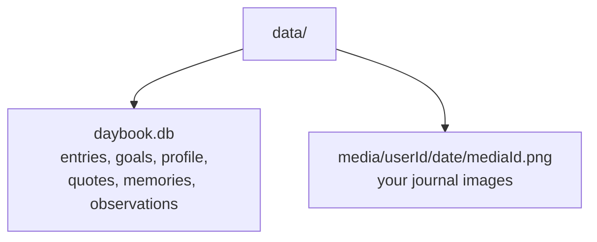

To back everything up, copy the `data` folder. To start completely fresh, delete it. It is recreated on the next run.

The database runs in WAL mode, so you may also see `daybook.db-wal` and `daybook.db-shm` sitting next to it. Those are normal. They hold transactions that have not been folded into the main file yet. Do not delete them while the backend is running, and do not copy the database file on its own while the server is running, or you can capture a half written state. Stop the backend first if you want a clean copy.

## Privacy

DayBook is built around local-first privacy.

Your journal contains personal information, so DayBook does not send it to third party AI services.

There is:

- No OpenAI API key
- No Gemini API key
- No hosted database
- No required cloud AI service
- No telemetry for your writing or your images

AI analysis runs locally through Ollama, images are written to your own disk, and the database is a file in your project folder.

Deleting your data is straightforward. Delete the `data` folder and it is gone.

## Development

Start the frontend:

```bash
pnpm dev
```

Start the backend:

```bash
cd server
pnpm dev
```

Build the frontend:

```bash
pnpm build
```

Build the backend:

```bash
cd server
pnpm build
```

Type check and lint the frontend:

```bash
pnpm exec tsc -b --noEmit
pnpm run lint
```

Type check the backend:

```bash
cd server
pnpm exec tsc --noEmit
```

Database tooling is available through Drizzle Kit from the `server` folder:

```bash
pnpm db:generate
pnpm db:migrate
pnpm db:studio
```

`db:studio` is a good way to look around when you are curious what got saved.

## Troubleshooting

**The Analytics tab looks empty.** The sidebar panel only renders on the Journal page. Open the journal first, then pick Analytics from the sidebar. If the book is still closing, the panel appears about half a second after the button highlights.

**Answers are slow, or it says the model is unavailable.** Check that Ollama is running with `ollama serve`, and that your chosen model is installed (e.g., `ollama pull gemma3:4b`).

**Adding an image says it is too large.** The limit is 5 MB. There is no automatic compression, so pick a smaller image or resize it yourself first.

**The photo shows after I pick one, but disappears on reload.** That means the journal was not saved. The preview only exists in memory until you press Save.

**The backend will not start because the database is locked.** Another copy of the backend is already running. Find it and stop it. If you recently restored a database file while the server was running, stop the server first and make sure the `daybook.db-wal` and `daybook.db-shm` files match the database you copied.

**Port 5173 or 3001 is already in use.** Something else is on that port. Close the other program, or change the port in `vite.config.ts` and in the `PORT` environment variable for the backend.

**Onboarding keeps asking again.** The profile is marked complete only after you finish the flow, so a half finished onboarding starts over next time.

**A date looks empty but you know you wrote something.** Check that the Calendar and the journal are on the same date. Goals always show today and the previous entry that had goals, no matter what date you browse to.

## License

Check [LICENSE](LICENSE) for license info.
